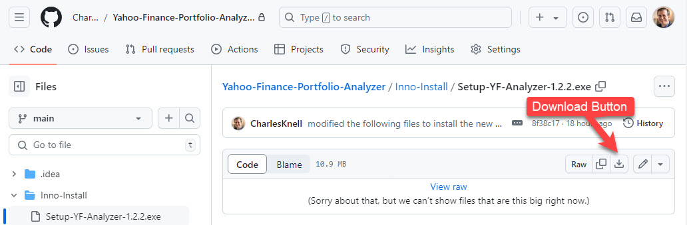

## Yahoo Finance Portfolio Analyzer
## A Program in Python

#### The purpose of this program is to show you the annualized gain for all stocks in your portfolio which have been held for a user specified minimum number of years.
#### Stocks picked by even the best stock pickers should be held a minimum of 5 years. I have personally found this to be an excellent investment strategy.
#### To use this program, you must first enter your stock data into a Yahoo Finance Portfolio. A v2.0 portfolio is recommended.

### Windows Setup

* The setup file, Setup-YF-Analyzer-x.x.x.exe, is located in the Inno-Install folder.
* Click on the download button.

* Install using Setup-YF-Analyzer-x.x.x.exe
* Start by clicking on the desktop icon titled "YF Analyzer x.x.x".

## After Starting the Program (Windows)
1. Change the path to the Edge browser path in the program's "Browser Path" field. 
   * In the "Type here to search" field (lower left hand corner of Windows), type "Edge". 
   * Right click on the best match and select "Open file location".
   * Right click on the "Microsoft Edge" shortcut and select "Open file location".
   * Left click in the middle of the blank area of the address bar and the path will appear.
   * Click on the "Change Path to MS Edge Browser" and navigate to and select the msedge.exe file.
2. Set and save the URL of the Yahoo Finance Export Link located on your portfolio page.

   * Right click on the "Export" link and select "Copy Link". 
   * Paste it into the program's "Yahoo Finance Export Link" field. 
   * Click on the program's "Save Yahoo Finance Export Link" button.

3. Click on the program's "Change Path to Downloads Folder" button to save the path to your "Downloads" folder.
   * Navigate to and select the "Downloads" folder in the "C:\\Users\\(your-username)" folder.
4. Set and save the program's "Minimum Holding Years" field for your analysis.
   * Fill in the field and click the "Save Min Holding Years" button.
5. Using Microsoft Edge (required), login to your yahoo account.
6. Click on the "Collect Data" button.
   * Wait 8 seconds for the download and computations to complete.
   * The Edge browser should appear, complete the download, and then minimize.
   * If the results window is blank, try the following:
     * Check the program's "Yahoo Finance Export Link" directly in the Edge browser and see if it downloads a portfolio.csv file. If not, correct the link.
     * Reduce the "Min Holding Years" to 0 to display the entire portfolio. You may not have held any stock for the "Minimum Holding Years".
