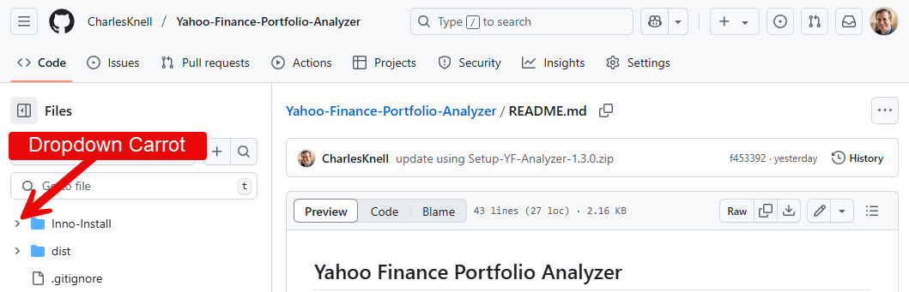
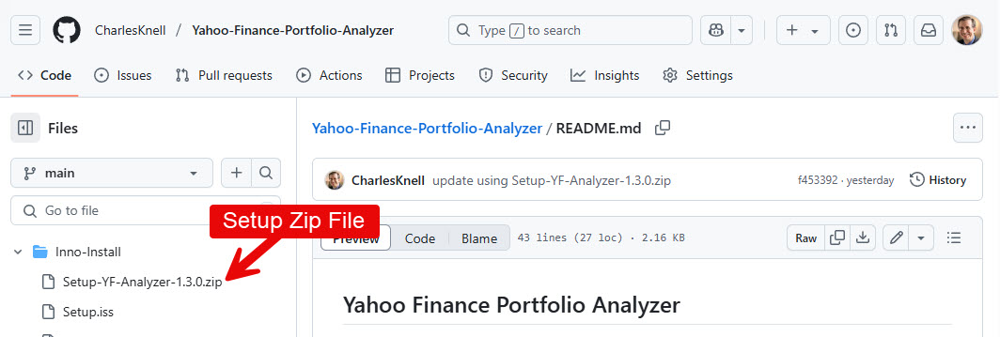
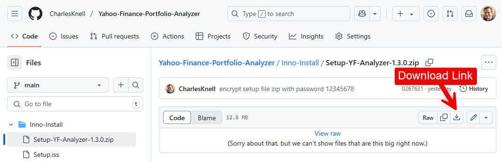

## Yahoo Finance Portfolio Analyzer
## A Program in Python

#### The purpose of this program is to show you the annualized gain for all stocks in your portfolio which have been held for a user specified minimum number of years.
#### Stocks picked by even the best stock pickers should be held a minimum of 5 years. I have personally found this to be an excellent investment strategy.
#### To use this program, you must first enter your stock data into a Yahoo Finance Portfolio. A v2.0 portfolio is recommended. 
#### This is a Windows only program.

### Windows Setup 

* The setup file zip file, Setup-YF-Analyzer-x.x.x.zip, is located in the "Inno-Install" folder.
* Click on "Inno-Install" folder dropdown carrot.

* Click on the setup zip file.

* Click on the download link.

* In your computer's Downloads folder, extract the setup file .exe from Setup-YF-Analyzer-x.x.x.zip
* My Downloads folder is located at "C:\Users\charl\Downloads". Yours will be named with your username, instead of charl.
* The password to open this zip file is 12345678
* Execute Setup-YF-Analyzer-x.x.x.exe to install the program.
* Start the program by clicking on the desktop icon titled "YF Analyzer x.x.x". Leave it running on your desktop for later use.

## After Starting the Program (Windows)
1. Sign in to your yahoo finance portfolio (v2.0 is recommended) and navigate to the "Holdings Tab". 

2. Note the location of the "Download Link" and save this window for later use.

3. On the "Yahoo Finance Analyzer" screen, click on the program's "Change Path to Downloads Folder" button to save the path to your "Downloads" folder.
   * Navigate to and select your personal "Downloads" folder in the "C:\\Users\\(your-username)" folder.
   

4. Set and save the program's "Minimum Holding Years" field for your analysis.
   * Fill in the field and click the "Save Min Holding Years" button.

5. Perform the three steps on the "Yahoo Finance Analyzer" screen.

6. In step 3, if the results window is blank, try the following:
     * Reduce the "Min Holding Years" to 0 to display the entire portfolio. You may not have held any stock for the "Minimum Holding Years".

7. Once step 2 is completed, you may collect data again using a different number of "Min Holding Years".  
     * In step 3, the data is being collected from the downloaded portfolio.
